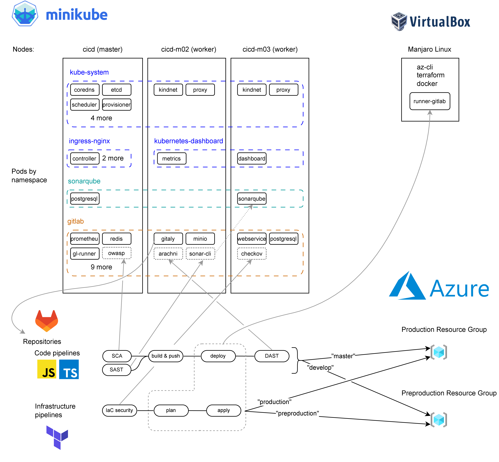

# Introduction
DevSecOps k8s cluster with GitLab (configured using Terraform) and pipelines for code with SCA (OWASP dependency check), SAST (Sonarqube) and DAST (Arachni), and infrastructure as code with IaC security analysis (Checkov) to deploy to Azure. Production and preproduction environments.

This repo contains a set of bash scripts to setup a DevSecOps kubernetes cluster in minikube. GitLab and Sonarqube get installed in it, and then GitLab is configured using it's Terraform provider. 

 

   
  <em>System overview and pipeline job placement</em>

# Pipelines
Code pipelines
- Source Code Analysis (SCA) with OWASP dependency check
- Static Aplication Security Testing (SAST) with Sonarqube
- Building and pushing of Docker images to Azure Container Registry
- Manual deployment of the images to Azure Container Instances to production or preproduction depending on the branch
- Dynamic Aplication Security Testing (DAST) with Arachni

 

Infrastructure pipelines
- Infrastructure as Code security analysis with Checkov
- Automatic planning of the Terraform project
- Manual deployment of the IaC to production or preproduction depending on the branch